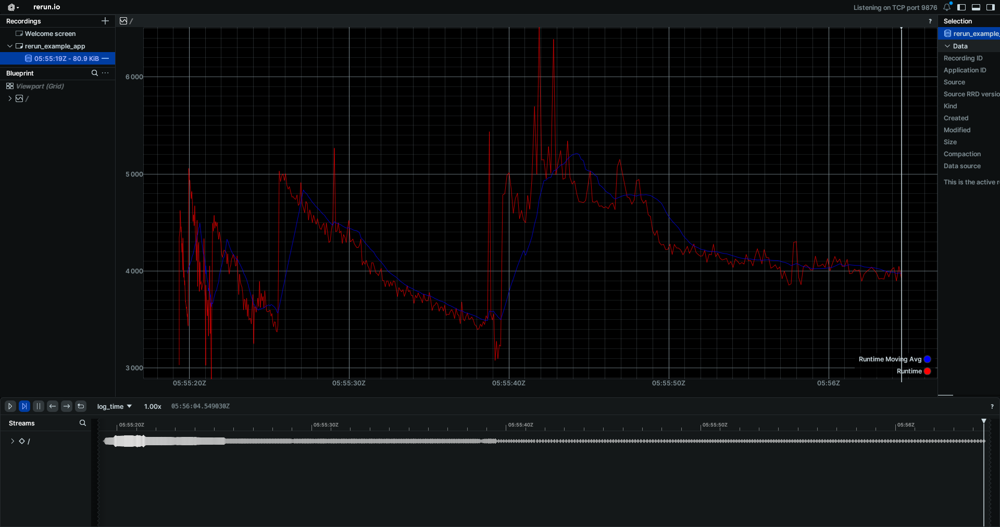

# Closure Runtime Plotter

### Features

* Data Visualization with rerun.io to display a graph of the runtime of a closure over time.
* Evaluating "setup" closures before the closure you want to benchmark, allowing for more usable benchmarking setups.
* This project also provides a DisJointSet struct that is there to use as an example of how to benchmark a library or a data structure.
* Moving Averages, runtime noise reduction.

### ScreenShots

